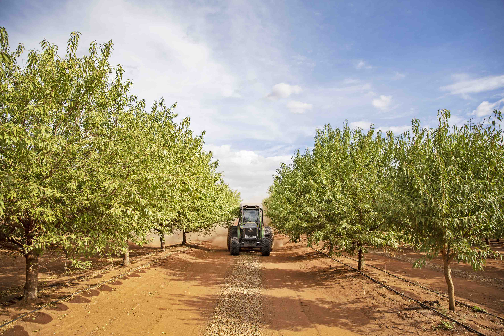

# Lidar based autonomous navigation on orchards.

It is difficult to save path for the entire orchards, its time consuming and
changing over a peroid of time. so we need to have system, understanding the 
surronding trees, and navigate properly.




# Usage

### To launch auto_nav

```commandline
roslaunch auto_nav auto_nav.launch 
```

### To Save path

```
roslaunch autopilot save_path.launch
```

### To collect data 
```commandline 
roslaunch auto_nav data_collect.launch
```

### To run auto_nav locally from previously ran bag files.
Assuming mavros and pilot are running on backgroud.
```commandline
roslaunch auto_nav auto_nav_on_bag.launch 
```


# Parametrs
Each parameter is self-explanatory and commented next to it on yaml file. 
please refer to below link to access yaml file.

[Parameter file ](params/autonav_params.yaml)

### Imp parameters

Please consider keeping proper farm details. 
 
```
auto_nav:
  farm_details:
    row_spacing : 8 # distance between the tree rows in meters
    

  ransac:
    tolerance : 3 # half of tree size in meters. 
```


# TODO's

 -[ ] dkjfng