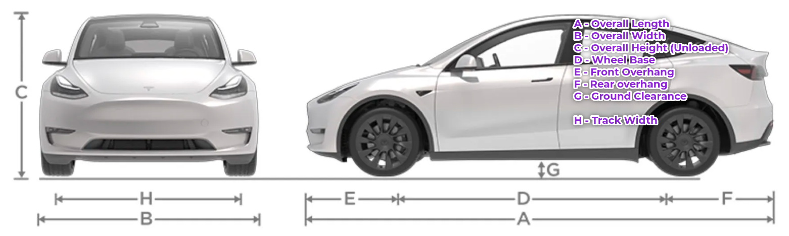

# vehicle_common package
This package containis Vehicle description config file, URDF file, map to base_link tf broadcaster, Python api to access vehicle related data(dimentions and sensor locations).
##  Vehicle config file
This a YAML file, having information about vehicle dimentions, sensor related information(sensor position and frame).

vehicle dimentions ref:

- You can chage the [YAML](params/half_cabin_config.yaml) file fields under `dimentions` depending upon the vehicle dimentions following above vehicle naming convention.
-  sensor info and locations from front_wheel axle center need tp filled under `sensors` in the [YAML](params/half_cabin_config.yaml) file.

<details>
<summary>View half_cabin_config.yaml</summary>

```
dimensions: # from mechanical team <saidinesh@bosonmotors.com>
  overall_length    : 3.883 # all the mesurments in MKS(meters, kgs, seconds)
  overall_width     : 1.725
  overall_height     : 2.095
  wheel_base        :  2.080
  track_width       : 1.446
  front_overhang    : 1.170
  rear_overhang     : 0.633
  ground_clearance  : 0.183
  payload           : 750 # kgs
  tyre_radius       : 0.338
  tyre_section_width :  0.145
  gear_ratio         : 10.214

motion_limits:
  max_forward_speed      : 3  # m/s
  min_forward_speed      : 0.3 # m/s
  max_backward_speed : -3
  min_backward_speed : -0.3
  max_acceleration : 0.5
  min_acceleration : -0.5
  max_steering_angle : 30 # degrees
  min_steering_angle : -30 # degrees

robot_origin_frame: "base_link" # name of link at rear wheel

base_link:   # center of the rear axle.
  gps_link:  # center of the rear axle to gps position, center point of two gps modules.
    x: 2.080
    y: 0.0
    z: 0.0
    roll: 0.0
    pitch: 0.0
    yaw: 0.0

  zed2i_base_link: # center of the rear axle to zed camera 
    x: 2.8
    y: 0.0
    z: 0.5
    roll: 0.0
    pitch: 0.0
    yaw: 0.0

  rslidar: # center of the rear axle to rslidar(3d lidar)
    x: 2.8
    y: 0.0
    z: 0.2
    roll: 0.0
    pitch: 0.0
    yaw: 0.0

  rplidar: # center of the rear axle to rplidar (2d lidar )
    x: 2.8
    y: 0.0
    z: 0.1
    roll: 0.0
    pitch: 0.0
    yaw: 0.0
```
</details>


## URDF file
ROS version of desciption of vehicle is called URDF(universal robot desciption file).

- All sensors Transforms realtive to base_link will be taken from config file in the URDF file.

### Adding new frame
To add new sensor, Create a frame under the base_link key in config file[YAML](params/half_cabin_config.yaml).
EX: Suppose you are helios lidar sensor with frame_id: helios_lidar_frame. 
```
 base_link: # robot base frame
   helios_lidar_frame: # sensor  frame newly added
    x: 2.8 # 
    y: 0.0
    z: 0.1
    roll: 0.0
    pitch: 0.0
    yaw: 0.0
```
In the vehicle_description.xacro[URDF](urdf/vehicle_description.xacro). add a new link with name with same frame_id

ex : 

`<link name="xyz_lidar_frame"/>`

Add new joint as below, consider to change the sub-key value to be same as frame_id. ie vehicle_info['base_link']`['helios_lidar_frame']`['x']

Ex:
```
  <joint name="2d_lidar_link" type="fixed">
    <!-- <origin xyz="2.8 0 0.1" rpy="0 0 0" /> -->
    <origin
        xyz="${vehicle_info['base_link']['helios_lidar_frame']['x']}
             ${vehicle_info['base_link']['helios_lidar_frame']['y']}
             ${vehicle_info['base_link']['helios_lidar_frame']['z']}"

        rpy="${vehicle_info['base_link']['helios_lidar_frame']['roll']}
             ${vehicle_info['base_link']['helios_lidar_frame']['pitch']}
             ${vehicle_info['base_link']['helios_lidar_frame']['yaw']}"
    />
    <parent link="base_link" />
    <child link="helios_lidar_frame" />
  </joint>
  ```

  Then save it and launch the [vehicle_desciptio.launch](launch/vehicle_description.launch) to refect the changes, make sure you have selected proper vehicle type and modified the correspoding config file.


## Map to base_link tf broadcaster [Node]
A node subscribes to odometry from mavros, publisher a proper tf (base_link as rear_axle of vehicle), Odometry (with child_frame base_link (rear_axle center)), and a Footprint of vehicle.

### Parameters:

* `base_frame` (string, default: base_link) - base frame of vehicle
* `odometry_in`(string, default: /mavros/local_position/odom) -  odometry topic name from mavros 
* `gps_in` (string, default: /mavros/global/position/global) Gps topic from mavros.
* `send_odom` (boolean, default: true) -true to publish odometry 
* `send_gps` (boolean, default: true) -true to publish GPS. 
* `send_footprint`(boolean, default: true) - to publish vehicle footprint
* `odometry_out`(string, default: /vehicle/odom) - name of odometry topic with child frame as base_link(rear_axle)
* `gps_out`(string, default: /vehicle/gps) - name of gps topic with child frame as base_link(rear_axle)
* `foorprint_out`(string, default: /vehicle/foot_print) - name of footprint topic which is of vehicle size.

## Python API for vehicle info
You can able to access all the feilds in [YAML](params/half_cabin_config.yaml) with DOT operator.

### Example

```
from vehicle_common.vehicle_config import vehicle_data
print(vehicle_data.dimensions.wheel_base)
print(vehicle_data.sensors.fcu.model)
```
